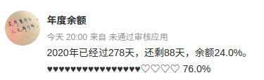

# Year Process Bar 年度余额进度条

这是一个微博自动发文项目，它的功能非常之简单，根据当前系统时间计算当年还剩余天数，并且计算出剩余天数的百分比，生成一段文字和字符图形，并定时自动发布到微博上，部署在自家的树莓派3B+上；




## 依赖

* python3 (本项目基于python3.7.3开发)
* weibo
* 微博账号
* 微博网页应用

## 如何使用

1. 修改 src/weibologin/weibologin.py 中的配置，并保存

   ```python
     4 APP_KEY=''    # 微博网页应用的App Key
     5 APP_SECRET='' # 微博网页应用的Secret
     6 APP_URL=''    # 微博网页应用的应用地址
     7 WEIBO_USER='' # 微博账号
     8 WEIBO_PW=''   # 微博密码
   ```

2. 运行

   `python3 main.py`

   